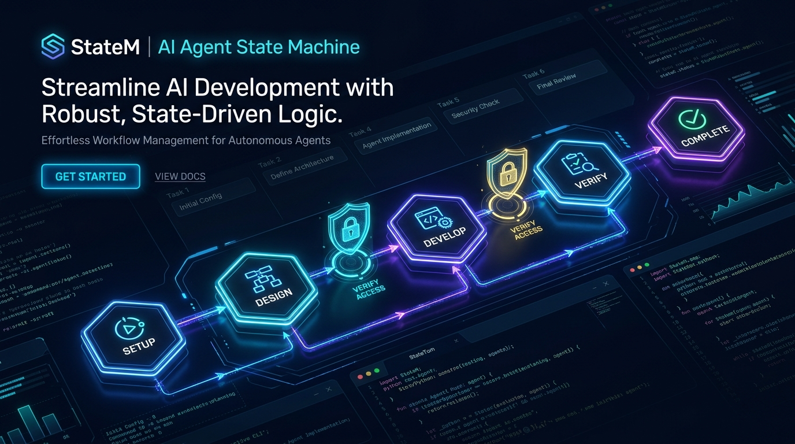
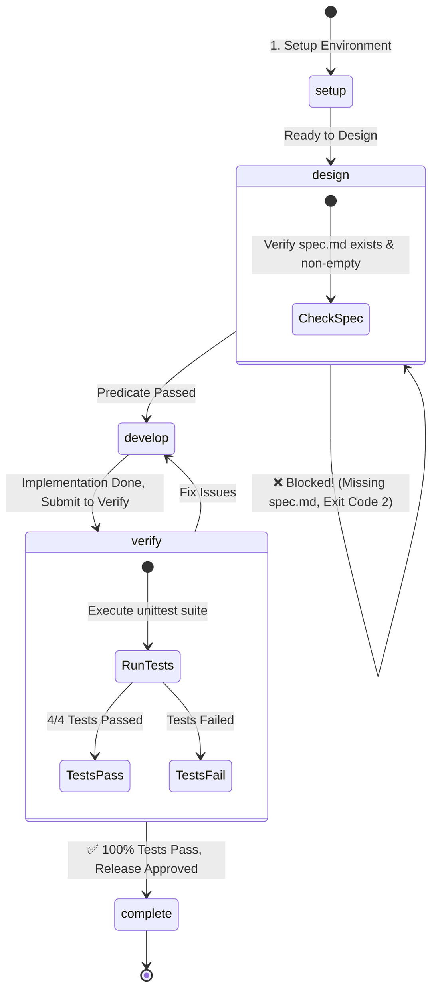

# Markdown Task Board Generator (StateM Governed Project)

<div align="center">



[English](README.md) | [繁體中文](README_zh-TW.md)

**A complete demonstration of building, verifying, and delivering a Python project governed by [StateM](https://github.com/henryqin1997/statem)**

</div>

---

## 🎯 What is this project?

This project demonstrates how to build and deliver reliable AI agent workflows using **StateM** — a lightweight state machine runtime that prevents premature handoffs, control dilution, and untested deliverables.

### Core Components:
1. **Python CLI Application (`task_board`)**:
   - 📑 **Smart Markdown Parsing**: Extracts `- [ ]` (TODO), `- [~]` (IN_PROGRESS), and `- [x]` (DONE).
   - 🏷️ **Tag & Priority Detection**: Detects `#tags` and `!HIGH` / `!LOW` priority markers.
   - 📊 **Dual Visualizations**: Renders clean terminal ASCII Kanban boards or GitHub-flavored Markdown boards with completion stats.
2. **StateM Runbook (`runbook.yaml`)**:
   - 🛡️ **Procedural State Machine**: Explicit boundaries across `setup`, `design`, `develop`, `verify`, and `complete`.
   - 🔒 **Executable Transition Gates**: Predicates and automated command gates enforcing quality before transitions.

---

## 🛡️ StateM Governance Lifecycle



---

## 🔍 Verified Transition Gates in Action

### 1. Predicate Gate Enforcement
In the `design` state, `spec.md` is required. When attempting to jump straight to `develop` without it, StateM immediately blocks the transition:
```text
$ statem goto develop --run-id taskboard-v1
exists expected True, got False; file does not exist: .../spec.md
statem: Transition 'design' -> 'develop' blocked before leaving 'design' [Exit Code: 2]
```

### 2. Automated Command Gate
In `verify`, StateM executes `python3 -m unittest discover` before allowing `complete`:
```text
$ statem goto complete --yes --run-id taskboard-v1
$ python3 -m unittest discover -s tests -p 'test_*.py'
....
----------------------------------------------------------------------
Ran 4 tests in 0.001s

OK
- All automated unit tests passed
- Markdown rendering checked manually
All tests pass and verified.
Pipeline execution completed successfully. Ready for release.
Moved: verify -> complete
```

### 3. Immutable Audit Trail
Check execution history anytime with `statem history`:
```text
Run: taskboard-v1
Current: complete
- 2026-09-10T11:15:06Z start setup
- 2026-09-10T11:15:06Z in_hook setup
- 2026-09-10T11:15:44Z goto setup -> design
- 2026-09-10T11:15:54Z goto_blocked before_transfer  <-- Recorded block event
- 2026-09-10T11:18:06Z goto design -> develop        <-- Unblocked after spec.md
- 2026-09-10T11:28:56Z goto develop -> verify
- 2026-09-10T11:29:03Z goto verify -> complete       <-- Released after 100% test pass
```

---

## 🖥️ Terminal Demo

```text
$ python3 -m task_board example_tasks.md --format ascii

=== Project Task Board [Progress: 40.0%] ===
+----------------------------+----------------------------+----------------------------+
|            TODO            |        IN_PROGRESS         |            DONE            |
+----------------------------+----------------------------+----------------------------+
| TASK-003: Design high-avai | TASK-005: Implement OAuth2 | TASK-006: Setup StateM pip |
| TASK-004: Add GraphQL API  |                            | TASK-007: Initial codebase |
+----------------------------+----------------------------+----------------------------+
```

---

## 🚀 Quick Start

### 1. Run the Task Board CLI

```bash
# Render ASCII Kanban Board
python3 -m task_board example_tasks.md --format ascii

# Render Markdown Summary
python3 -m task_board example_tasks.md --format markdown
```

### 2. Run Tests

```bash
python3 -m unittest discover -s tests -p "test_*.py"
```

### 3. Inspect or Re-run the StateM Runbook

```bash
# Validate runbook spec
statem validate runbook.yaml

# Check current run status
statem cur --run-id taskboard-v1

# View execution history
statem history --run-id taskboard-v1
```

---

## 📄 License
MIT
