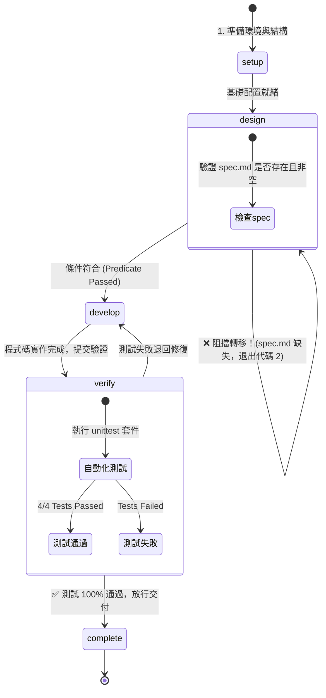

# Markdown 任務看板產生器 (StateM 治理示範專案)

<div align="center">


[English](README.md) | [繁體中文](README_zh-TW.md)

**專為可靠 AI Agent 長程任務設計的輕量級狀態機運行環境實戰示範**

</div>

---

## 🎯 這是什麼專案？

本專案是一個完整的實戰範例，展示如何使用 **[StateM](https://github.com/henryqin1997/statem)** 狀態機來引導、約束與交付一個 Python 應用程式。

### 兩大核心組成：
1. **Python CLI 應用程式 (`task_board`)**：
   - 📑 **智慧解析 Markdown**：自動解析待辦清單（`- [ ]` 未完成、`- [~]` 進行中、`- [x]` 已完成）。
   - 🏷️ **標籤與優先級識別**：支援標籤提取（如 `#security`）與優先級標記（如 `!HIGH`）。
   - 📊 **雙格式視覺化**：支援終端 ASCII Kanban 看板與 GitHub 風格 Markdown 看板，自動計算完成率。
2. **StateM 運作規格書 (`runbook.yaml`)**：
   - 🛡️ **程序性狀態機（Procedural State Machine）**：定義嚴謹的生命週期。
   - 🔒 **自動化守衛（Transition Gates）**：利用條件斷言（Predicate）與自動化命令（Command Gate）阻止過早交付與略過測試。

---

## 🛡️ StateM 治理生命週期圖解



---

## 🔍 核心守衛機制實測驗證

### 1. 條件斷言阻擋 (Predicate Gate)
在 `design` 階段設定了 `predicate: spec.md, exists=True`。在規格書尚未撰寫前嘗試推進時，StateM 會強制攔截：
```text
$ statem goto develop --run-id taskboard-v1
exists expected True, got False; file does not exist: .../spec.md
statem: Transition 'design' -> 'develop' blocked before leaving 'design' [Exit Code: 2]
```

### 2. 自動化測試命令閘門 (Automated Command Gate)
在 `verify` 階段設定了 `command: python3 -m unittest discover`。流轉至 `complete` 時自動執行測試，唯有通過才能抵達完成態：
```text
$ statem goto complete --yes --run-id taskboard-v1
$ python3 -m unittest discover -s tests -p 'test_*.py'
....
----------------------------------------------------------------------
Ran 4 tests in 0.001s

OK
- All automated unit tests passed
- Markdown rendering checked manually
All tests pass and verified.
Pipeline execution completed successfully. Ready for release.
Moved: verify -> complete
```

### 3. 不可篡改的運行歷史軌跡 (Audit Trail)
執行 `statem history --run-id taskboard-v1` 可隨時審計所有狀態與阻擋歷史：
```text
Run: taskboard-v1
Current: complete
- 2026-09-10T11:15:06Z start setup
- 2026-09-10T11:15:06Z in_hook setup
- 2026-09-10T11:15:44Z goto setup -> design
- 2026-09-10T11:15:54Z goto_blocked before_transfer  <-- 成功記錄被阻擋事件
- 2026-09-10T11:18:06Z goto design -> develop        <-- 補齊 spec.md 後通過
- 2026-09-10T11:28:56Z goto develop -> verify
- 2026-09-10T11:29:03Z goto verify -> complete       <-- 自動測試通過後交付
```

---

## 🖥️ 終端執行展示

```text
$ python3 -m task_board example_tasks.md --format ascii

=== Project Task Board [Progress: 40.0%] ===
+----------------------------+----------------------------+----------------------------+
|            TODO            |        IN_PROGRESS         |            DONE            |
+----------------------------+----------------------------+----------------------------+
| TASK-003: Design high-avai | TASK-005: Implement OAuth2 | TASK-006: Setup StateM pip |
| TASK-004: Add GraphQL API  |                            | TASK-007: Initial codebase |
+----------------------------+----------------------------+----------------------------+
```

---

## 🚀 快速上手

### 1. 執行看板 CLI 工具

```bash
# 輸出 ASCII 看板
python3 -m task_board example_tasks.md --format ascii

# 輸出 Markdown 總結
python3 -m task_board example_tasks.md --format markdown
```

### 2. 執行單元測試

```bash
python3 -m unittest discover -s tests -p "test_*.py"
```

### 3. 檢驗或操作 StateM 狀態機

```bash
# 驗證 runbook 語法與規則結構
statem validate runbook.yaml

# 查看目前 Run 的狀態與提示
statem cur --run-id taskboard-v1

# 查看完整的狀態流轉歷史紀錄
statem history --run-id taskboard-v1
```

---

## 📄 授權條款
MIT License
